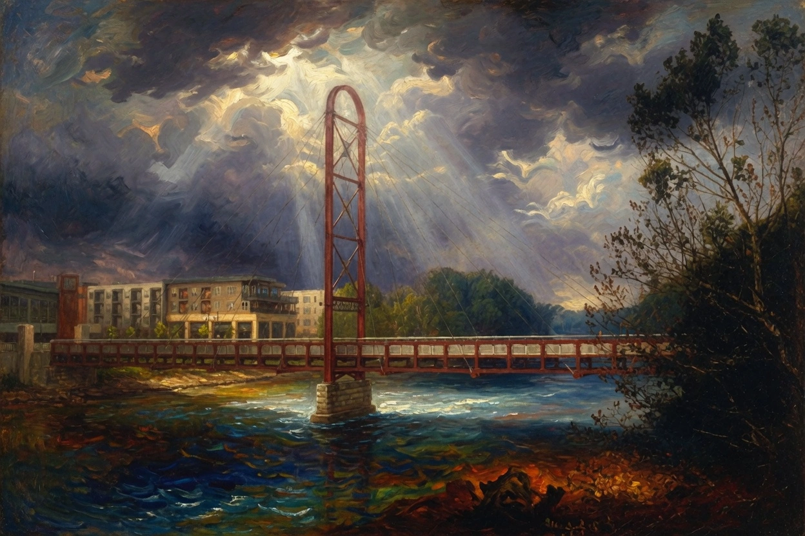
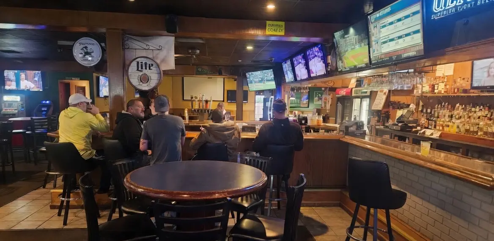
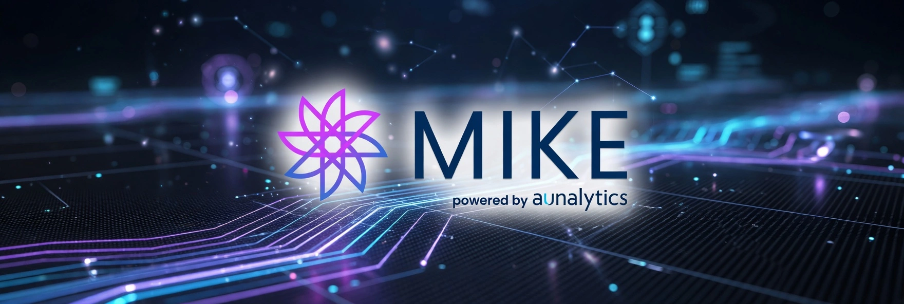
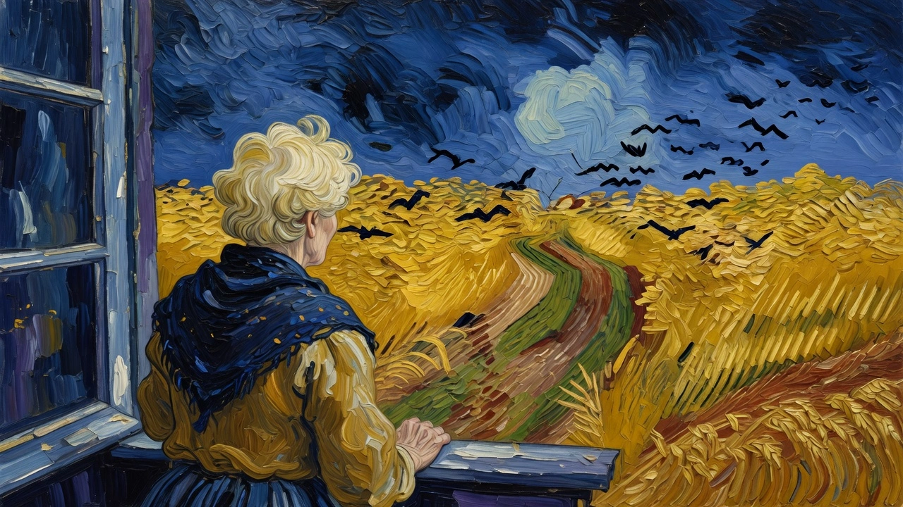
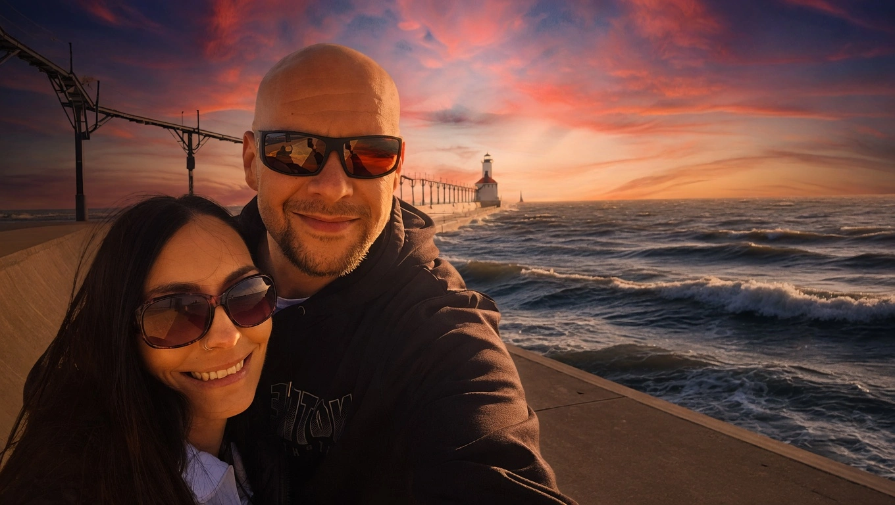
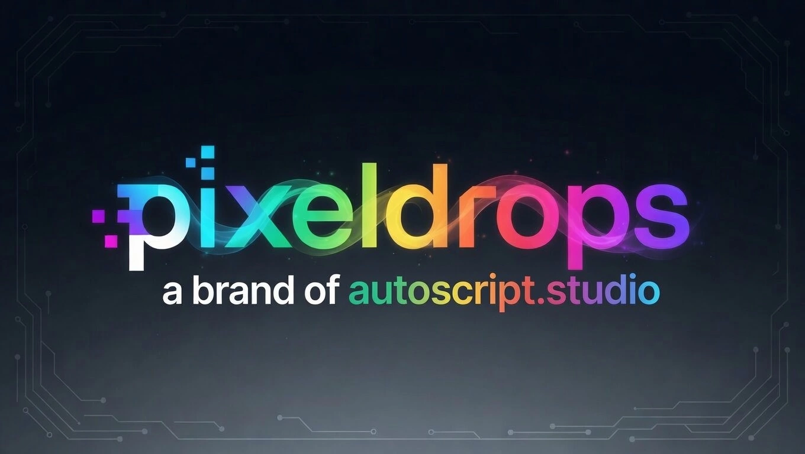

There are eight billion people on this planet. I doubt more than twenty of them will ever read this post, and of those twenty I doubt a meaningful percentage will give much of a shit. Fine by me. The blog's been dark for two and a half years. This one's mostly for me — a marker I can stumble over years from now and remember, in specifics, the stretch where my whole life changed and the hell I had to walk through to get to the life I deserve.

There's a pile of fucked-up shit that came before this story even starts — decades of it, the kind that will almost certainly never be written down. I've paid those dues, and I've earned my peace.

For most of my life I've been afflicted — and I'll stand behind that word — with seeing the numbers 9-1-1. Every day, often multiple times a day. Clocks, license plates, the back of receipts, hotel rooms I didn't pick, the timestamp on a text I didn't want to open. Call it confirmation bias, call it pattern recognition, call it the universe trying to tell me something — depends on what kind of mood you catch me in. Here's the part that used to bug me: I was born on 3/18/1979. Run that through the numerology math and it shakes out to a birthday number of 9 and a life path of 11. Nine, eleven. Believe in that stuff or don't — the math is the math. For decades I had no idea what any of it was supposed to mean. Then on September 11, 2023, I found out my wife had been cheating on me again, and the number finally delivered its memo.

That's not the post, by the way. This is all I'm ever going to say on the subject — that shit is in my rearview mirror where it belongs. I'll spare you the receipts here. It's enough to say it was ugly in the specific way that only a long marriage to the right combination of character flaws can be ugly — somewhere in the neighborhood of battling Amber Heard and Jada Pinkett Smith rolled into one, with the legal fees to match. I lost everything I'd spent twenty-plus years working for. I have never in my life been happier to lose.

This post is about what came after.

## Walking

I'd spent most of my adult life behind a screen. Twenty-six years in IT will do that — my identity was my job, and my job was a keyboard, and when I got home the only thing I could bear to look at was a different keyboard. I was a workaholic by default. That was the shape of me.

After I left, I couldn't stomach the idea of sitting down in front of a computer for a single unnecessary second. Whatever I was going to rebuild, it wasn't going to be that. I traded the screens for walking. I picked a spot — the **Mishawaka Riverwalk** — and started going, and kept going, and fairly quickly I stopped being able to imagine the version of my life where I didn't go. I'd read somewhere that walking heals the part of the brain that trauma wrecks. I don't know if that holds up under a white coat, but I can tell you it held up under my shoes.

I was fasting twenty hours a day. The anger — and there was a lot of it those first months — turned out to be excellent fuel. *Mindset rocket fuel*. I dropped a serious amount of weight very quickly, which was a nice side effect of going through the worst chapter of my life. Credit where credit is due.

The anger didn't last long, though, and here's the part that surprised me: this wasn't the first time. Or the second. Or — I'm embarrassed to put a number on it. The pattern was old enough by September 2023 that the news didn't hit like the first time anymore.

Why did I stay? Because my parents split up when I was a kid for the same reason, and I'd promised myself my whole life I would never do that to my own family. I held onto that belief like it was load-bearing. It wasn't. Keeping the family together was not, in fact, more important than my own happiness, and I was an idiot for thinking it was. I put up with what the next hundred men put together wouldn't have. I'm still mad at myself for not having the self-respect to walk out earlier. Lesson learned, paid for in cash.

*Been there, done that. Not dragging my own corpse through another round of dark-road self-pity.* The stages of grief are supposed to take months or years. I kung-fu'd them in weeks. People say "I don't recognize who I was before" — for me it was the opposite. I finally recognized who I was, and who I'd been pretending to be for a long time on someone else's behalf.

The silver lining showed up early. I was free. Free to do whatever I wanted whenever I wanted. I was happy — actually, measurably, day-to-day happy — for the first time in as long as I could remember. Stress still existed but had lost its grip on my nervous system. Losing everything I'd worked for turned out to be the cost of being myself again, and the math worked out cleanly: I'd have paid more. I traded a lifetime of insomnia for being an early bird. I've gotten up at 5 AM almost every day since I walked out of that house. I like it.

## Mitch's Corner

I was nervous about figuring out how to meet a woman. I was also wrong about it — turns out the secret is "leave the house and go somewhere." I know. I'm embarrassed I had to learn that as an adult, but I did, and if you're coming out of something and quietly worrying that you've forgotten how human beings work, the answer is mostly just: show up.

Here's something I picked up on the way: people who've lived under narcissistic abuse tend to stop going places. They cancel plans. They invent excuses. The pattern is subconscious — they're hiding shame that isn't theirs, on behalf of someone who made them feel it. When I started recognizing the pattern I'd been running, I started running a different one. I put myself in rooms with people.

**Mitch's Corner** is a neighborhood sports bar, and that was the room. Small, unpretentious, the kind of place where by the third visit the bartender knows your drink and by the fifth you're on a first-name basis with people whose last names you'll never learn. I started going. I started staying. I started making actual friends — the first real new friends I'd made as an adult in I don't want to say how long.

Some random woman at the bar, a few visits in, told me I was *hypervigilant*. I had to Google the word. Alien environment, no rules, no commitments, testing out freedom for the first time in my life — of course I was hypervigilant, I was a man freshly released from a cage and still checking the ceiling for bars. It took a while to loosen up. When I did, the strangest fucking thing started happening: women started giving me attention. For the first time in my entire life, at the age I am, at the weight I was, women were noticing *me*. I can't overstate how surreal that was. I kept turning around to see who they were actually talking to. Turns out it was me. Turns out it had been an option all along.

## Work

All of this — the walking, the bar, the slow rebuild — was happening while the divorce itself dragged on for over a year before it was finalized. Through that whole stretch I somehow kept my head above water at work. I'd taken an Internal IT role at **Aunalytics** on a two-person team: me, and the lead engineer I'd been hired under.

Call him my Yoda. I'm going to keep him anonymous, partly because of how this ends. The guy was an encyclopedia of IT knowledge — he could rattle off the seven layers of the OSI model from memory, no *Please Do Not Throw Sausage Pizza Away* required. Which I'm technically supposed to be able to do but realistically Google like a human being with working common sense. He was the intellect; I was the grunt. I liked the split.

The problem was focus. He was on prescribed Adderall and popping it like Skittles. At night he smoked weed the way other people watch the news. His brain was brilliant and scattered in equal measure, and he had a hell of a time actually finishing things. The last day I worked with him, he spent half the shift trying to figure out where on earth you buy a gallon of beaver anal gland secretions, because he'd just found out that *castoreum* — which is, technically, beaver anal gland secretion — has historically been used as a vanilla flavoring. I wish I were making that up. It's just not something a gainfully employed adult usually spends a Thursday trying to source a gallon of.

The next morning I got pulled into a Teams chat and asked to disable his account. They'd let him go. I felt genuinely bad for him — good guy, heavy personal stuff of his own going on — but the HR side wasn't my call. Wherever he landed, I hope he's good. If we ever cross paths I owe him an IPA and an afternoon of catching up.

The practical side, in the meantime, was: *what the fuck am I supposed to do now*.

For the next eight months the answer turned out to be *everything*. I ran the entire internal IT operation alone, which was partly competence and partly pure stubbornness, since I was also finalizing a divorce and watching my mother slide into dementia in the same stretch. When a replacement finally landed — a good hire; I'll call him Newblood, because that's what he became in my head — I was genuinely thrilled to have a partner back on the team.

And that's when I hit burnout for the first time in my career.

I've been in IT since 2000. Twenty-six years of steady grinding across Microsoft 365, Active Directory, Intune, Entra, infrastructure, endpoints, tickets. I'd always found it interesting. Now I was tired, and I hated that I was tired — plenty of people would have killed for my role, and I did not want to be the ungrateful prick. But *interested* had quietly turned into *done*, and I didn't know how to get it back.

What broke the spell was a Teams chatbot.

Quick context: the company I work for is effectively two companies stapled together. One half is an MSP serving hundreds of clients across Michigan, Indiana, and Ohio — data centers, cloud services, service desk, the whole shebang. The other half develops AI products on top of client data. Last year we started building **MIKE** — *Managed Insights and Knowledge Engine* — an internal LLM trained on our own company's data, our clients' documentation, and our entire ticketing history, so our managed-services team could ask it a ChatGPT-style question and get answers grounded in what we actually know.

MIKE started as a web interface. Someone wanted a Teams chatbot version, because all of us live in Teams anyway. I got pulled into the meeting as the M365 tenant admin — the one with the keys to plug it in — and halfway through I was asked if I could actually *build* it. Which was a hell of a question, given the company employs dozens of real developers who do this for a living. I semi-volunteered. I've been an AI junkie for years — accounts on ChatGPT, Grok, Gemini, Claude, GitHub Copilot, used daily for my own projects and for anything at work that saves me keystrokes — and the idea of building a production chatbot on top of our own model was exactly the kind of challenge I hadn't had in years.

I built it. It turned out great. More importantly, it got me out of the loop I was stuck in. I turned into a black hole, obsessed with making the thing better.

A few months into all of that, the company posted a job for **AI Quality Analyst**. I read the post, thought *what the hell do I have to lose*, and put my name in the hat. The interview ended up being with my own boss — who, if I got the role, would stay my boss. I love working for the guy. That helped. The offer came back fast, and on April 1, 2026, I officially moved into the new role full-time.

I'm two and a half weeks in as of this writing. I continue to work on the chatbot and on agent development, and I'm also responsible for making sure the data MIKE is trained on is accurate and complete. The difference between a useful AI product and a confident-sounding liar is mostly the training data. That's the job. I've already done work I'm prouder of than most of what I shipped in the last two years. Burnout is gone. I am, for the first time in a long time, genuinely excited about the work I do every day. A job in AI, aligned with my personal interests more tightly than any role I could have designed for myself. Along the way the comp jumped — a couple of massive raises, which are basically the only reason I've kept my head above water through the divorce. I could not be happier with where I landed.

## Mom

My parents split when I was in fifth grade, so they weren't together when my dad passed in 2020. About a year after he died, I started noticing the first cracks in my mother's memory.

The clearest early incident was her birthday in 2021. The four of us — me, my then-wife, my sons — made plans to meet her at **Carrabba's**. We showed up on time. We waited an hour. We called her, repeatedly. No answer. When she finally walked in she said she'd been stuck in traffic. She lived five minutes away.

It kept happening. Plans she'd made with us — *come to the house for dinner* — and we'd arrive to a dark house and an empty driveway. I'd track her phone and find her across town at a friend's place, with no idea she'd had anywhere else to be. Her friends started pulling me aside, worried. For at least a year before I left my marital home I was calling her every day to check in and remind her of the things she used to hold without help.

I believe in divine timing. I'd been worried about her living alone for a long time, and when the divorce blew up my life I moved in with her. That's when I learned how bad it really was.

The forgetting was one problem. The nights were a different one — sundowning, I learned later — where she'd surface into full delusions. I was being kidnapped and held against my will. She torched a lifelong friendship over a delusion she'd convinced herself was real. I'd walk her back to reality and in the morning she'd wave it off as a bad dream. Then it would happen again the next night. The summer her closest friend went to Croatia, I picked up dog-sitting at the friend's empty house, and the few times I stayed over to get a few hours of distance, my mother would call me in the middle of the night screaming that she was going to send the police to *surround* me. By morning she'd have no memory of it. I'd have to pretend it never happened or it would destabilize her for the day.

Her doctor called me at work one afternoon and asked if I'd start coming to appointments and making sure my mother took her thyroid pill daily. Then she said the word out loud — *dementia* — on a phone line, in the middle of a Tuesday. I'd already known for a year and a half. Hearing a doctor say it was still a punch in the gut.

One morning she woke up convinced her car had been stolen from the driveway. It hadn't. She had driven to a dollar store near the house the afternoon before and walked home without remembering she'd driven. By the time I got the car back to her driveway she'd already revised the theft story in her head — someone must have moved it as a prank, or I had done it to mess with her — because "I drove there and walked home and forgot" was not a version of events her brain could hold. That's the shape of most of it. The real thing happens, the memory of the real thing disappears, and the brain backfills with something else, and then she's certain.

When I finally took her car keys away — because she'd been getting lost coming home from the grocery store and zig-zagging across town for hours, insisting she was fine — I became the villain of the story. She decided I was the one trying to control her. That I had diagnosed her, not her doctor. That her doctor had actually told her her brain was *99% good and 1% bad*. She'd scream at me like I wasn't her son. It was the scene from *The Exorcist* where the mother is looking at her child and the thing looking back isn't her anymore. Daily, for months.

It's not daily anymore, and it's not a question mark anymore either — the diagnosis came back official: Alzheimer's. Now it's a rotation — normal days alongside days where she wakes up as a paranoid, delusional version of herself I cannot reach. I wouldn't wish this on my worst enemy. I thought the divorce was the hardest thing I was going to go through. It turns out the divorce was the warmup.

There's nobody else to share this with. My older sister was killed in a car accident when I was 18; I have no other siblings. My oldest son **Joey** moved in with me last year. The divorce was hard on him — he loves his mom and she's been a good mom to him his whole life, but for reasons that are his to tell, not mine, he couldn't live with her anymore. He needed his peace too. He helps where he can with my mother's care, which is more than I had any right to expect. The brunt is still mine. I take it day by day, watching a slow-motion trainwreck I can't stop, hoping she eventually comes to terms with what's wrong so she can find whatever peace is still on the table.

Life keeps handing me copious amounts of stress, so the man upstairs must think I can handle it. Or I was a rotten son of a bitch in a previous life and this is the bill coming due.

## Her

Have mercy.

That's Uncle Jesse from *Full House*. **Rianna** deserves the full Stamos.

I first noticed her at Mitch's sometime in late 2024. One of the regulars there — a guy who seemed to rotate through good-looking women on a roughly monthly cycle — had brought a new one around, and the new one was her. I was dating someone at the time, which meant my entire job whenever she was in the room was to NOT look at her. My inner monologue ran on a loop for weeks: *don't look at her, don't look at her, don't look at her.* Eventually I picked up her name secondhand. Rianna. *That's cute, like the singer*, I remember thinking. *Never met a Rianna before.* I never actually had a conversation with her.

Then one night we were both outside, and I overheard her telling someone, *I got married to the wrong person, had three awesome kids, and got divorced, and it was the best thing that ever happened to me.* I straight up butted into the conversation. *Hey — that's my story.*

By the end of the year both of our relationships had fizzled out independently. The morning of New Year's Eve 2024 I was doing my usual morning routine, and for whatever cosmic reason she popped into my head for half a second as I was thinking about what I might be doing that night. Five minutes later my phone dinged. Facebook friend request. From her. *Oh damn, that's cool. What are the odds.* I accepted, scrolled her photos for a minute, told myself it didn't mean anything and not to read into it. A lot of us at Mitch's are Facebook friends.

That evening I ended up where I always end up: Mitch's. And there she was, at a table with a friend, being aggressively hit on by some drunk dude really shooting his shot. I wandered over and started bullshitting — the first real conversation I'd ever had with her. I read the room quickly: she and her friend were not opposed to the free drinks the dude was buying for the table, but she was not feeling him at all. I could feel a spark between us. I was still new to meeting women at this point in my life, but when you know, you know. We did shots to bring in the new year.

Just after midnight she stepped outside for a cigarette. I kept thinking *she's so out of my league*, and right behind that thought was *but you have to bring in the new year with a kiss*. I had no idea if I was about to get slapped, but the spark between us had me confident enough. I followed her out, spun her around, and planted one on her. Total fireworks. What a start to 2025.

We were alone for the kiss, but right before we walked back inside, a couple of regulars stepped outside and saw us hugging. Pretty sure that kicked off the rumor mill on the spot — that place can be a little bit like high school with cliques and rivalries and the whole shebang. We didn't care.

We both left for the night not long after. I live two minutes from there, and I had to pull the car over behind **Pet Supplies Plus** because I was in total shock. I must have said *oh my god* out loud ten times before I could put it back in drive. We messaged each other to make sure we'd both gotten home okay. Woke up the next morning, and we've been Bonnie and Clyde ever since.

In the months that followed we started noticing other coincidences. Her ex and mine have the same name, spelled differently. When we met, she was dating a guy named Nick. I was dating a girl named Nikki. We both have a heart with wings tattooed on the same spot on our left forearms, both of us predating the other by years. For a guy who opened this post talking about being *afflicted with seeing the numbers 9-1-1*, I have a hard time waving any of that off as random.

We talk from the moment we wake up to the moment we go to sleep, every single day, without missing a beat. It's been that way ever since that morning. We had both been through toxic partners, and we both knew exactly what we wanted out of a relationship. I don't want to jinx anything, but almost fifteen months in we have not had a single argument or disagreement. *Yet.* I say *yet* because I know it can't last forever — but I really never knew a healthy, loving relationship like this could exist. For the first six months I was convinced I was actually in a hospital somewhere in a coma and imagining all of this, because she was too damn good to be true. I still feel that way.

Every other weekend, we're at Mitch's together — playing darts (we've both gotten halfway decent) and bullshitting with the regulars. I never expected to be the guy with a regular bar at this age. I am now. One night last year, while we were there, we caught the tail end of a situation that ended up reshaping my relationship with the place. A couple was there on a first date. The girl had passed out cold in the bathroom — on the floor, in her own piss — and a group of regulars by the bar didn't like the way her date was insisting on taking her home. They suspected he'd dosed her drink. Rianna went into the bathroom to take care of the girl. I went outside, where the South Bend cop who works Mitch's on the weekends had already told the date he wasn't leaving with her. The guy got aggressive. The cop tried to tase him; the prongs didn't make it through the guy's t-shirt. He stopped being aggressive and started threatening the cop's life directly. I went over and pinned him in the corner of the lobby with one arm twisted behind his back until backup arrived.

That's how I got to know the cop. He and I have been friends ever since, and I now do the door at Mitch's during Notre Dame home games and fill in when they're short. Rianna had the bathroom while I had the lobby. We didn't compare notes until afterward.

I slowly started meeting her family, and her family is the biggest single Italian-American clan I have ever heard of in my life. Their family reunions need a soccer field to take the group photo. No joke — there are something like five hundred of them. There's never a dull moment, because there are so many of them that there's always a birthday or a graduation or a game night, and the holidays are an absolute blast. We can barely go anywhere in town without bumping into one of her cousins. I come from such a small family that this is genuinely alien to me, but I love it. I love how completely they've taken me in. Every moment I get to spend with them is a moment I'd take again.

And then there are her three kids. I don't say *amazing* lightly, and I'm not saying it because I'm biased — she could have had three little shitheads. These kids are not. She's genuinely blessed, and thankfully two of them are about the same age as my youngest, **AJ**, and they all get along great. All three of my own kids love her. We've turned into our own little nuclear family, and given that family life is the only life I've ever known, I am in heaven right now.

Our days are a chaotic circus — jobs, kids, schedules, the works — but we make it work, and we spend every minute we can together, and we are both genuinely excited about whatever comes next. This woman is the love of my life, and the reason I want to be the best version of myself I've ever been.

## The side stuff

I've been a busy fucking bee for the last five months or so. Somewhere around the end of 2025 I started using **Claude Code**, and within a week I'd ripped through the regular plan's usage limits and upgraded to MAX, which is the polite version of saying I had a problem. The honest version: I'm like a mad scientist cooking up everything I can imagine with Claude Code. That's what I love about it so much — anything you can imagine, you can turn into a reality with it. I'm a true Claude junkie.

The first wave was rebuilding old projects. I went back through stuff I'd shipped years ago — Faceoff among them, which has a post on this same blog from the Hugo era — and made them better than the originals. After that I just started building.

Most of what I built is private. Some of it has potential SaaS implications and I want to keep that option open; the rest is because I'm obsessed with optimization and I'll never stop polishing these things, and I'd rather not commit half-finished ideas to a public repo I'd have to apologize for later. I'll write deep-dive posts on a few of them over the coming months. The current section is the catalog, not the manual.

The meta-tools came first, because if I was going to spend serious time inside Claude Code I wanted infrastructure around it. I built **[Claude Sentient](https://github.com/thebiglaskowski/claude-sentient)** — an orchestration layer that wraps Claude Code's native features into an autonomous development loop with quality gates, profile detection, hooks, MCP integration, and a thousand-plus tests. I used it for months, kept improving it, and recently realized something: at the rate Claude is shipping new native features, my abstraction layer was becoming overhead. I started pulling Sentient out of my projects and going straight vanilla. The repo's still public if anyone wants to pick over it.

I also built **PromptVault**, a personal prompting engine — deterministic compiler, card and template system, semantic search, the whole nine. I do not use this as much as I originally intended, but it's still pretty cool to have on hand. Honest read on both: cool, instructive, no longer load-bearing.

Then came the personal-utility wave. **BudgetLedger** is a Flask app I built when my expense-tracking spreadsheet — the one I've maintained since 2009 — finally choked under the weight of new credit cards I'd opened to build credit. I wired BudgetLedger up to Plaid for live account sync, did the whole pay-period planning thing where the app auto-assigns bills to specific paychecks based on due dates, shipped split transactions and recurring schedulers and a bulk tag editor. It's a real Flask app. I built it, I used it, and I went back to the spreadsheet — the system was just complex enough that maintaining it became more friction than running the sheet. The good news: the sheet is now on steroids compared to its 2009 self, because building BudgetLedger taught me what was missing.

**Nexus Signals 2.0** is a market-analysis platform for crypto and stocks — FastAPI, async SQLAlchemy, Postgres with pgvector, React 19 with TradingView charts, seven stock-data providers with circuit-breaker fallback chains, twenty-three technical indicators, paper trading, LLM-powered sentiment, 3,764 passing tests. The "2.0" is real — I got far enough into v1 to realize I could do it better, and I scrapped it and started over. It's parked right now because I switched gears to income-generating side stuff, but it's parked on purpose, not abandoned.

**[xrp-ticker](https://github.com/thebiglaskowski/xrp-ticker)** is a Textual TUI portfolio tracker for XRP — pulls live price from Coinbase, aggregates self-custody wallet balances over XRPL WebSocket, sparklines that cycle through four styles, two themes, keyboard-driven. It's small. It still runs on my second monitor. The repo's public.

Then I got serious about turning some of this into income. I built an SEO content suite — a TypeScript monorepo with thirteen packages forming a pipeline from seed-keyword discovery through gap analysis, revenue-per-keyword scoring, competition analysis, AI content generation, AI image generation, static site building, all the way through to GEO scoring (Generative Engine Optimization — evaluating content for AI-citation readiness across ChatGPT, Perplexity, Google AI, Claude). SEO had been a passion of mine over a decade ago, and AI made it interesting again — the niche-finding game is fun when you have a real research engine behind it. The working name needs to change (the obvious one is taken) and I haven't picked the replacement yet.

Then I got distracted by TikTok dropshipping videos, the way you do, and built **DropTok** — a multi-shop platform for running TikTok Shop dropshipping with AI-generated listings, a content pipeline that produces hooks and shot lists for short-form video, a creator CRM, an AI-scored opportunity board, and integrations into TikTok Shop Seller, TikTok for Business, TikTok Ads, CJ Dropshipping, and AutoDS. Both of these are deferred — still on the roadmap, just probably a year out before they get traction. It's been a messy, ambitious five months trying to figure out which direction to commit to first. I'm in a better spot with it now.

The legitimate-business side is **AutoScript Studio LLC**, which I formed specifically because I wanted a real business entity before flipping any of these on. AutoScript is the parent; **PixelDrops** is the digital-products brand that sits underneath it. PixelDrops is the current focus.

While I was waiting on AutoScript Studio's funding to clear, I wrote a romance novel using AI under a pen name (which I'm keeping pen-shaped on this blog — I want the book to stand on its own). It's heading to Amazon as a test. If it sells, I'll write more. If it doesn't, I'll have learned something useful about a workflow I expect to use a lot more of.

I also started a YouTube channel: **StackTrace Docs**, a documentary channel telling old IT stories from the eighties, nineties, and early two thousands. Episodes that don't exist anywhere else, told the way I'd want to hear them — voice-driven narration, period-accurate visuals, real research underneath. The channel is still finding its visual feet, but the production pipeline behind it is the most interesting build of the bunch.

The pipeline is three private tools that hand off to each other in a chain. Two of them are named `-cli` and have GUIs anyway — bad naming on my part, but the names stuck. **scriptcast-cli** is stage one — it takes a finished script and runs it through Fish Audio's S2-Pro model to produce long-form narration audio, with inline emotion tags (`[tense, urgent]`, `[measured, authoritative]`) and beat markers that get aligned to the rendered audio with WhisperX, producing a Remotion-compatible `beats.json`. The script itself comes out of a research process that runs through Claude on Cowork, ChatGPT, Perplexity Pro, Gemini, and NotebookLM — I use whatever's best at each step.

**shotlist** is stage two, and it's the one I spend the most time in. It's the storyboard that pieces together the documentary I'm working on — a browser-based visual asset manager that parses the prompt sheet (also generated by Claude during scriptcast's prompt-sheet step) into a grid of empty slots, hands me each prompt one at a time on a clipboard copy, and watches the assets folder for the images and video clips I generate. I still pick every shot myself — pasting prompts into Grok Imagine, Midjourney, and Kling, modifying each prompt until I like the result, downloading, assigning. A thirty-to-forty-minute episode runs about a hundred and fifty individual visual mixes. That's the part where the AI does not do it for you.

**framecast-cli** is stage three — a Remotion-based assembly engine that takes the audio, the beats, the assigned images, and the project config, and renders a 1920×1080 H.264 MP4 at 30fps with Ken Burns motion on the stills, crossfade transitions, lower thirds at beat boundaries, and a per-era color grade and film texture so 1995 footage doesn't look like 2025 footage — that era value flows from Claude's classification all the way through the chain. I've had to work hard on getting everything synced up properly with the voice narration from scriptcast-cli and the way framecast-cli puts it all together. Several rebuilds later, I'm in a pretty good spot with this entire process and pipeline.

I run all of this — AutoScript Studio, the channel, the side projects, finances, personal life, health — out of **Cowork**, Anthropic's desktop app. It's where I draft this blog. It's where I track the LLC formation paperwork. It's where I outline novel revisions, sketch episode beats, and check off bills. Claude isn't just a code generator for me anymore — it's how I run my life.

I need to cram thirty hours a day into twenty-four to do everything I want to do. The roadmap is the only thing keeping the chaos honest — PixelDrops first, then DropTok once the channel monetizes and starts pulling sponsors, then the SEO work after that. That's the ladder. It's deliberately stretched out, because I'd rather get one thing actually working than seven things half-working.

Here's the part I haven't said yet, which is also the part the chaos earns its weight from: the divorce left me empty-handed, and the deal I made on the way out left me responsible for paying for basically everything I paid for when I was married. Everything. I made that deal for two reasons that aren't anybody else's business in this post — but the upshot is I'm still on the hook, post-divorce, for every bill I was already paying when we were married. Indefinitely. I knew it would be a long sacrifice. I've always said I have the patience of ten monks, which is a gift and a curse. When I made the deal, I never imagined I'd fall in love again, and I never imagined I'd want to move forward as fast as I want to now. I'm patient. I'm also drowning under the obligations I agreed to, and I'd like to climb out.

Either XRP appreciates the way I think it eventually will and I can start earning yield on it, or one of these side businesses gets off the ground and starts generating real income. I'm betting on both, hedging by working on both.

With AI, it's like having a hundred expert employees at my fingertips working on aspects of my business I'd never be able to do on my own. That's the real story under all of this — one person can ship this much because the rules of the game changed. I get to be the mad scientist and the hundred employees and the editor at the same time. I'm excited to see the AI space grow, especially since I just landed my dream job working with AI.

## Landing

That's the speed-run. Divorced, free, walking when I make myself, promoted and paid, in love, caregiving, occasional bouncer, building things, and back to writing.

Some honest notes before I let you go. I still see the numbers 9-1-1 all the time — the universe didn't lay off that one. The walking that powered the recovery year has slowed down a lot. Rianna is a good cook. Claude Code is a black hole. I dropped sixty-five pounds at the bottom of the divorce chapter and forty of them have crept back on, and I'm sitting at the same crossroads I always end up at. The screens are what they are — it's the only life I know and I was never going to escape it entirely — but those couple of years away from a keyboard were the longest break I'd taken in twenty-three years, and I needed every minute of it. The early-bird part stuck. The 5 AM still happens. The walking is what I'm trying to put back in.

I'm still figuring out what this new life looks like. Building a future with Rianna while drowning in debt from the divorce is the next stretch of work, and none of it is solved yet.

Here's the through-line, though — with the one obvious exception of what's happening with my mother, every corner of my life has gotten better since I walked out. Friendships. Romance. Social standing. Work. Money. A sweet new car last year I still can't quite believe I'm driving. I've paid my dues. I've taken more trips to hell and back than I want to count. Whatever you call this — karma circling back, the universe finally paying down a long-overdue tab — I'll take it.

This blog goes back to what it used to be — technical nerd posts about whatever I'm building. Maybe a beer review when one earns it. The occasional off-topic detour. This is probably the only personal post you'll get out of me for a long while; I needed to mark the chapter once, in one piece, before going back to the work.

More soon. Different kind of more.