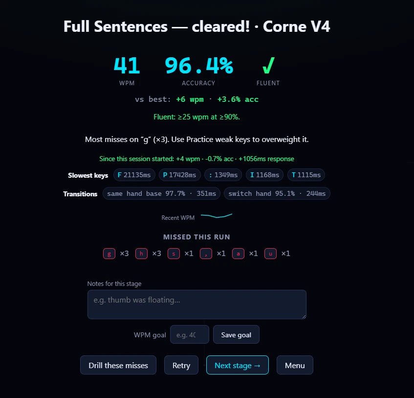

I spent years assuming my wrists hurt because of carpal tunnel. It's the reflex diagnosis for a guy who's typed for a living since the Y2K panic — something finally aches, and of course it's carpal tunnel, that's the keyboard guy's version of the runner's bad knee. Everybody knows that one. So I did what you do with a problem that already has an explanation attached: I ignored it for a long time.

When I finally got serious — read past the first search result, actually paid attention to what was happening — the story fell apart. Carpal tunnel is a median-nerve problem: numbness and tingling in the thumb, index, and middle fingers, usually worst in the middle of the night. I didn't have any of that. What I had was random. Some days my wrist was fine. Other days it hurt like hell for no reason I could point to, and every so often something stupid and small — turning a doorknob — would fire a shooting pain up the thumb side of my wrist and buy me an hour of sitting there massaging it. No numbness, no nighttime pattern, just a thumb-side tendon that apparently had opinions now. Median-nerve problems don't do that. Inflamed tendons do. What I had — what I'm now pretty sure I had — was **De Quervain's tenosynovitis**: the tendons that run your thumb, swollen and cranky from doing the same few motions a couple million times. Twenty-six years of mouse-clicking and space-bar-thumbing will apparently send a bill, and mine had come due.

## The overhaul

Once I knew what I was actually dealing with, I went at it like a project. Thumb spica splints to wear — the little braces that lock the thumb still so the tendon can stop screaming. A daily set of tendon-glide and wrist-mobility exercises, the kind you do to walk the inflammation back instead of just resting and hoping. A **vertical mouse**, which holds your hand in a handshake position instead of the palm-down one that's been quietly torquing your forearm your entire career. And the big one — the one this post is actually about — I threw out my keyboard.

Not for a normal keyboard. I'd been living on a full-size board with a number pad, the kind that parks the mouse a country mile to the right and keeps both wrists cocked outward all day. I replaced it with a **Corne V4** — a 40%, 3×6 split ortholinear keyboard. If you don't speak keyboard: *split* means it's two separate halves you can set shoulder-width apart so your wrists point straight ahead instead of angling in. *Ortholinear* means the keys sit in a clean grid instead of the staggered rows we all inherited from mechanical typewriters — a stagger that existed to make room for little metal arms and has no reason to still be here except that every one of us learned to type on it. And *40%* means it's tiny. No number row. No function row. No dedicated symbol keys. Roughly forty keys total, and everything else lives on *layers* you reach by holding a thumb key.

That last part is where the trouble started.

## The problem nobody's tutor solves

A 40% layered keyboard makes you a beginner again. To type the number 4, you hold the left thumb key and press where R used to be. A parenthesis is a held layer plus a shift plus a key. The muscle memory I'd spent a quarter-century building was suddenly worth about as much as my cursive. I sat down in front of a keyboard — the object I am, on paper, an expert at — and could not reliably find the number 4. That is a humbling afternoon.

So I went looking for a typing tutor to drill it back, and that's where I hit the wall. Every typing trainer on the internet — **MonkeyType**, the old typing.com stuff, all of them — is built for a flat QWERTY board. They teach you to move flat fingers to flat keys. Not one of them has any concept of *holding a layer.* They can't teach "hold left thumb, tap for the 4, release, keep going," because on the keyboards they were built for, that motion doesn't exist. The single skill I most needed to rebuild was the exact skill no tutor would touch.

I've spent the last couple of years building things with Claude and Copilot for fun and for work. You can probably guess what I did instead of just practicing.

## Layer Tutor

I built **[Layer Tutor](https://layer-tutor.pages.dev/)** — a browser-based typing trainer for split, layered keyboards. It's the tutor I couldn't find. (The [source is on GitHub](https://github.com/thebiglaskowski/layer-tutor) if you want to poke at it or fork it for your own board.)

The whole trick is that the app knows what my actual keyboard looks like. The Corne's layout exports from **Vial** — the firmware config tool — as a `.vil` file, and Layer Tutor reads that file directly, so the on-screen keyboard is geometry-accurate: the real column stagger, the real thumb cluster, the real layer assignments. When it wants a 4, it lights up the physical key, shows me which thumb has to be holding which layer, and flags whether shift is in play. Then it does the one thing MonkeyType won't: it *waits.* The cursor locks until I hit the right key. A wrong key flashes red and the app refuses to advance. No forgiving approximations, no "close enough" — you build the correct motion or you build nothing.

The curriculum runs 15 stages, home row up through full mixed-layer mastery. You start on the base keys, work out to each hand in isolation, unlock the left-thumb numbers-and-navigation layer, then the right-thumb symbols layer, and finally the stages that make you bounce between all of them mid-sentence the way real typing actually does. You need 90% accuracy to advance, and there's a "Fluent" badge that only shows up at 90% accuracy *and* 25 words per minute, which — spoiler — I do not currently have.

The piece I'm quietly proud of is the adaptive drilling. The app tracks which keys I miss and how long each one takes me to find, then builds custom drills weighted toward the weak spots — so I'm not burning reps on keys I already own, I'm grinding the transitions that keep tripping me. There are per-key heatmaps so my problem zones light up on the board, daily streaks, WPM sparklines, and a sandbox where I can paste real text — a shell command, an email, whatever — and just type without it counting against my stats.

Under the hood it's deliberately boring, which is a compliment. Vanilla JavaScript, ES modules, zero dependencies, no framework, no build step. The game engine is pure logic that has no idea the DOM exists, which made it easy to test with Node's built-in test runner. Progress lives in `localStorage`. It's a **PWA** with a service worker, so it works offline and pauses itself when the window loses focus. It auto-deploys to **Cloudflare Pages** on every push to `main` through GitHub Actions. The whole thing is MIT-licensed and multi-board ready — if I pick up an Iris or a Lily58 down the line, I can register it without stomping my Corne stats. None of that is impressive engineering, and that's the point. It's the least machinery that does the job, which is the kind of build I like most.

## The valley

Here's the honest part. I'm still slow. Genuinely, embarrassingly slow — the kind of slow where firing off a Slack message feels like defusing a bomb. Every guide about switching to a board like this warns you about "the valley," the stretch where your old speed is gone and your new speed hasn't shown up yet, and they are not exaggerating. I'm a 26-year keyboard professional currently typing like I'm wearing oven mitts, and there's no shortcut through it except reps. Layer Tutor makes the reps *targeted* instead of random, which helps, but it can't do them for me.

And I don't actually know yet whether any of it worked — that's the thing I have to be straight about. It's early. Wrists are a long game; De Quervain's walks back over weeks and months, not afternoons, and "I bought a split keyboard and my tendons healed" would be exactly the kind of tidy story I don't trust when other people tell it. Ask me in six months. What I can tell you is that I can find the number 4 now without looking, which I flat-out couldn't do when I started, and that the whole setup — straight wrists, handshake mouse, thumbs doing the reaching instead of my pinkies — *feels* less like slowly spraining myself all day. Whether "feels better" turns into "is better" is the part I don't get to know yet.

The irony isn't lost on me: I had a wrist problem, and my response was to build software that demands I type more. If that isn't the most IT thing I've ever done, it's close. But the typing was going to happen either way — at least now it's aimed at the right target.

And here's the part I didn't see coming. I got into split keyboards to save my thumbs, and somewhere in the reps I started to suspect I'd wandered into one of those rabbit holes you don't climb back out of. The Corne is a 40% today, but there's an Iris and a Lily58 and a few hundred custom builds out there, and I can already feel myself turning into the guy who has opinions about switch springs and thumb-cluster geometry. I built multi-board support into the app before I'd consciously admitted I was going to want more boards, which probably tells you where this is headed. I'll be in the valley a while. Turns out I'm in no hurry to leave.
